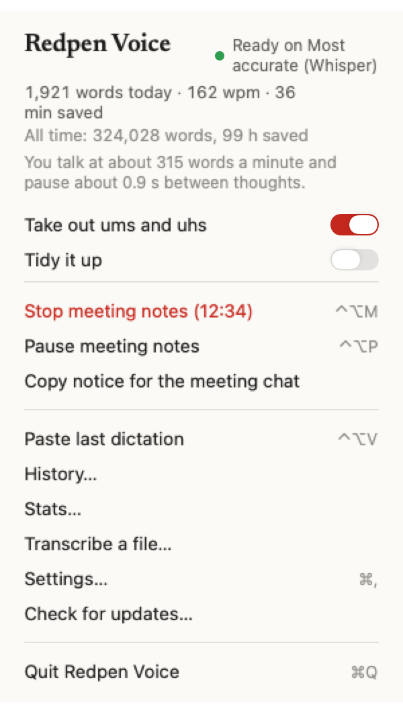
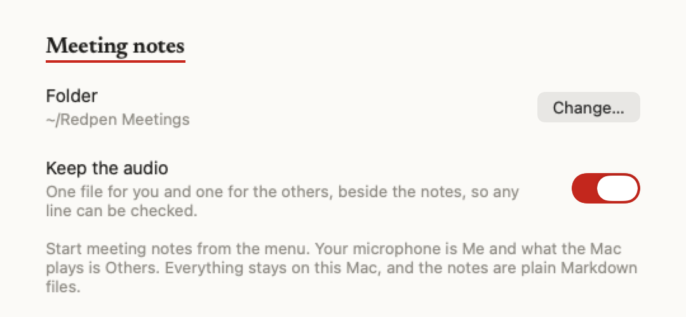
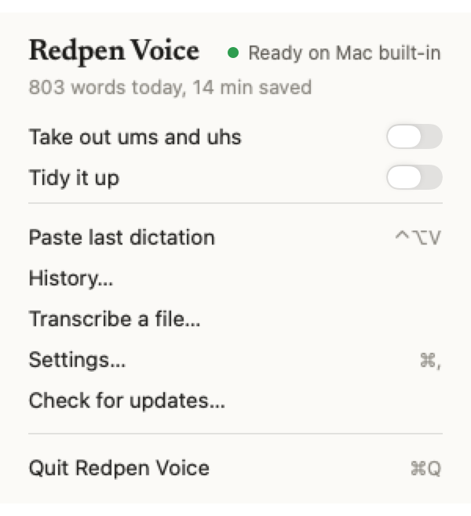
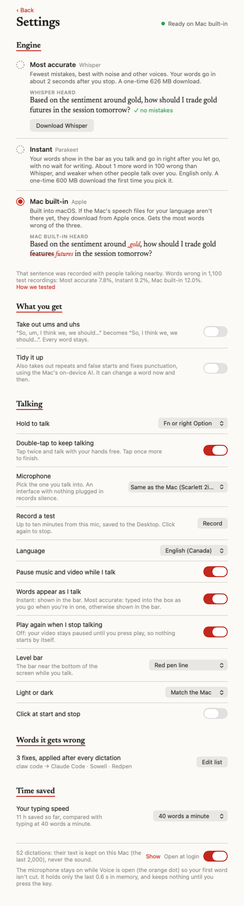
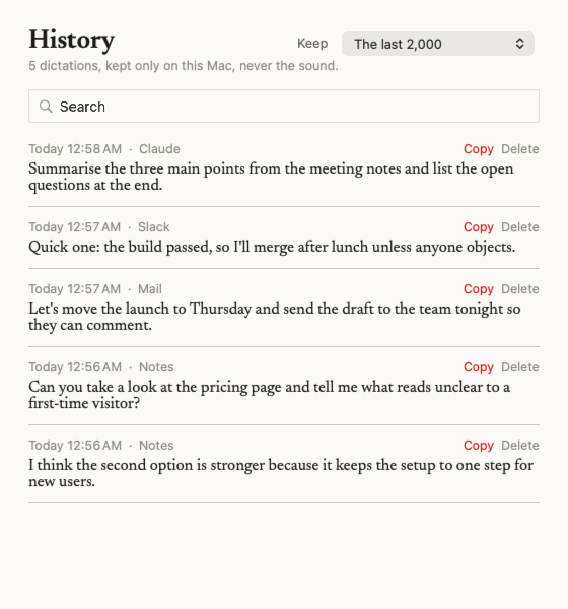
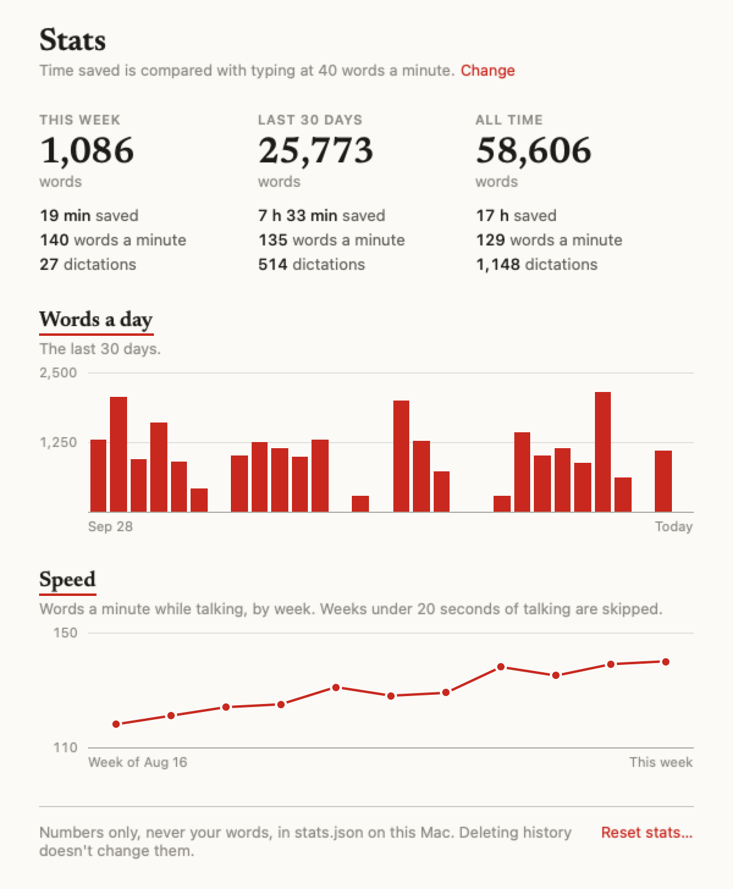

# Redpen Voice for Mac

A free, private dictation app for macOS, from the Redpen family of writing tools. Hold a key, talk, let go, and your words land where the cursor is, in almost any app.

Everything runs on your Mac. Your voice is never sent anywhere.

**[Download Redpen Voice for Mac](https://github.com/cjaynewton/redpen-voice-mac/releases/latest)** (free, macOS 26, Apple silicon)

<p align="center">
  
</p>

## How it works

1. **Hold Fn or right Option and talk.** A small bar at the bottom of the screen moves with your voice, so you know it's listening. With the Instant engine, your words show in it as you talk.
2. **Let go.** The words go into the box you started in, without touching your clipboard. If Voice can't see them arrive, the bar says so. Click into a text box and press Control-Option-V to paste them.

   

3. **Moved somewhere else while it wrote?** Voice checks the box you started in. If that box still matches, the words go there when the app allows it, or wait until you return. If the box changed or Voice can't be sure, Paste last keeps the words.

   

Tap the talk key twice to start hands-free. Tap once to stop. Extra taps just after stopping, or while the words are still being written, are ignored. If the Mac misses a key release, Voice checks whether the key is really up and ends the hold.

### Pick the bar you like

<table>
<tr>
<td valign="top"><br><b>Red pen line</b><br>A pen line that moves with your voice, and the time.</td>
<td valign="top"><br><b>Rolling tape</b><br>Your voice scrolling past, with a recording dot.</td>
</tr>
<tr>
<td valign="top"><br><b>Bars from the middle</b><br>Bars that grow from the centre.</td>
<td valign="top"><br><b>Classic bars</b><br>A level meter, like a recorder.</td>
</tr>
<tr>
<td valign="top"><br><b>Breathing dot</b><br>Just a dot that breathes, and the time.</td>
<td valign="top">Or turn the bar off in Settings.</td>
</tr>
</table>

## What it does

- **Any key you like.** Fn, right Option, or a key you pick in Settings.
- **Words appear as you talk.** With Instant, your words show in the bar while you talk and go into the box right after you let go. With Whisper, each stretch is written at your next pause, so a one-minute dictation lands about 2 seconds after you stop; in a text box the words are typed as you go.
- **Your words, as said.** By default nothing is rewritten. Two switches change that:
  - **Take out ums and uhs** removes only the sounds. Every word stays.
  - **Tidy it up** also takes out repeats and false starts and fixes punctuation, using Apple's on-device model. It can change a word now and then.
- **Three engines, named for what they do.**
  - **Most accurate** is Whisper, OpenAI's model: the fewest mistakes, words about 2 seconds after you stop, a one-time 626 MB download.
  - **Instant** is Parakeet Unified, NVIDIA's model: it writes while you talk, so there's no wait for writing (about 0.05 seconds), with about 1 more word in 100 wrong than Whisper. It is English only and weaker when other people talk over you. It needs a one-time 600 MB download.
  - **Mac built-in** is Apple's engine, built into macOS (if the speech files for your language aren't on the Mac yet, they download from Apple once), with the most mistakes of the three.
- **Words it gets wrong.** A plain list, one per line. `claw code = Claude Code` fixes what it hears. A name on its own keeps that spelling when the engine hears it. For Whisper, you can also turn on spelling hints in Settings; these can add to the wait.
- **Learns your names.** Fix a name by hand after a dictation ("so well" to "Sowell") and the second time you make the same fix, it goes into your list. Only names and terms are learned, never everyday words, and the list stays a plain file you can edit.
- **Suggests words to add.** After a name appears in three finished dictations across at least two days, a small note offers Add or Not now, at most once a day after talking. Add puts it in your word list; Not now dismisses that word for good. Turn off "Suggest words to add" in Settings. Only word counts are kept locally, with no sentences, and choosing to keep no history clears them and stops counting.
- **Learns how you talk.** Like a driving app that learns how you drive, it learns your pace and how long you pause, and uses that to decide where a thought ends. Only the numbers are kept.
- **Goes back to the box you started in.** Voice checks the window, the conversation when the app exposes it, and the text it expects in that box. The same chat box can grow or move while you talk. If you switch apps, words go straight into the original box when that app allows it, or wait until you return. If you edited or sent the box, or Voice can't tell whether it still matches, Paste last has the words. On a web page or video, nothing is typed there. Voice asks you to click into a box. If there is no typing target, the bar says the words are kept for Control-Option-V.
- **Fits the sentence.** Dictate into the middle of a sentence and the first word starts lowercase ("and then and we go"), except "I" and names from your list; right before a word, the closing full stop goes. Only in boxes that tell Voice what's around the cursor.
- **Paste last.** Click into a text box, press Control-Option-V, then release the keys. Voice waits for the keys to come up, pastes, and checks for the words or the expected cursor movement. The bar says "Pasted" only after that check. If it can't confirm the paste, it says so and leaves the words on the clipboard for Command-V, unless you copied something new meanwhile. Paste last dictation in the menu uses the same check. Dictations are also in History for as long as you choose to keep them.
- **Take it back.** Control-Option-Z removes the last dictation, only when it is still the last thing typed.
- **Pauses your music and video** when you hold to talk or start hands-free, only when something is actually playing. It starts them again after the words are finished. Turn off "Play again when I stop talking" in Settings to leave them paused.
- **Transcribe a file.** Turn an audio or video file the Mac can read into text, saved beside the file, or on the Desktop if that folder can't be written to.

## Meeting notes

Voice can take notes on a call in Zoom, Meet, Teams or any app that plays the call through your Mac. Choose Start meeting notes in the menu. Your microphone is recorded as Me and what the Mac plays is recorded as Others, each on its own track, so the transcript knows who said what without guessing from voices.

The first time, Voice reminds you to tell people you're taking notes and can copy a short notice for the meeting chat. On laptop speakers the microphone also hears the others; Voice drops those echoed lines from Me, and headphones avoid them.

A small bar stays at the bottom of the screen while it records. It shows the time, a level for Me and one for Others, and Pause and Stop. Drag it anywhere and it remembers the spot. Click the time to fold it down to the red square. Control-Option-P pauses and resumes, and Control-Option-M stops, even while another app is in front. The bar never takes the focus from the call and hides while you dictate.

<p align="center">
  
</p>

<table>
<tr>
<td valign="top"><br><b>Paused</b><br>Nothing is recorded until you resume. The transcript marks how long the pause was.</td>
</tr>
<tr>
<td valign="top"><br><b>No sound from the Mac</b><br>If the Mac has played no sound at all after 20 seconds, the bar says so. Allow it opens the System Audio Recording setting.</td>
</tr>
<tr>
<td valign="top"><br><b>Writing notes</b><br>After Stop, the notes are written on your Mac and the file opens when it's done.</td>
</tr>
</table>

The notes are one Markdown file in `~/Redpen Meetings`, named with the date and time. At the top is a summary: a short overview, then key points, decisions and to-dos, each ending with the time it was said, like `[12:34]`, so you can find it in the transcript. Apple's model writes it on this Mac, and Voice checks every item before it goes in. The line at that time has to say it, with the same numbers. An item no line says is left out, and the summary counts how many were. A to-do needs someone saying they'll do it or asking for it, so thanks and goodbyes never become to-dos. If Apple's model isn't available, the file says why there is no summary.

Below the summary is the transcript, one paragraph per turn, each with its time and Me or Others. The audio is kept beside the notes, one file for each track, unless you turn that off in Settings.

**Better summary, if you want one.** You pick the model. In Settings, Better summary with can be Claude, ChatGPT, Gemini or Cursor, using your own plan through that company's command-line tool (Claude Code, Codex, the Antigravity CLI or Cursor's agent), never an API key. Settings lists the ones installed on your Mac without starting them. Once you choose one, it checks that one is signed in and says how if it isn't. For anything else, such as OpenRouter or Ollama, choose Your own command and type the command. It gets the instructions and the transcript on its input and prints the summary. It runs in a fresh shell that reads `~/.zprofile` but not `~/.zshrc`, so any key it needs goes there or in the tool's own settings. Voice never runs it to check. It's off until you choose. After the notes are saved, the bar offers it. Nothing is sent until you click. The first time, Voice tells you where the transcript will go and waits for your yes, and for your own command it asks again whenever you change the command. Its summary goes on top with the same check, labelled with who wrote it, and Apple's stays below it.

**Or on this Mac.** Better summary with can also be On this Mac: a stronger writer than Apple's, downloaded once and run inside Voice, so the transcript never leaves your Mac. Voice picks it from your Mac's memory: Qwen3.6 35B (a 20.4 GB download) with 48 GB or more, Gemma 4 small (5.2 GB) with 16 GB or more. Below 16 GB it isn't offered and Apple's summary stays. Settings shows the name and size before anything starts, then one click downloads it from Hugging Face with a progress bar and Cancel. Every file is checked against the one listed for that exact version before it's used. Remove deletes Voice's copy. If the same version is already in Hugging Face's own folder on your Mac (`~/.cache/huggingface/hub`), Voice reads it there and downloads nothing. After the notes are saved, the bar offers Better summary on this Mac. The writer loads only when you click, takes about a minute for an 18-minute meeting, and is unloaded straight after. Its summary gets the same check and goes on top, labelled with the writer's name.

<p align="center">
  
</p>

The recording is saved to disk as it goes. If Voice or the Mac quits during a meeting, the menu offers to write notes for the unfinished meeting the next time it opens.

<p align="center">
<picture>
  <source media="(prefers-color-scheme: dark)" srcset="docs/screenshots/menu-meeting-dark.png">
  
</picture>
<picture>
  <source media="(prefers-color-scheme: dark)" srcset="docs/screenshots/settings-meeting-dark.png">
  
</picture>
</p>

## The menu

Click the Voice icon in the menu bar for today's words, your speed and the minutes they saved you, with an all-time line under them; the two switches; Paste last dictation, History, Stats, Transcribe a file, Settings and Check for updates.

<p align="center">
<picture>
  <source media="(prefers-color-scheme: dark)" srcset="docs/screenshots/menu-dark.png">
  
</picture>
</p>

## Settings

Every choice on one page: the engine, how your words come out, the key you talk with, your microphone, the bar, your list of words it gets wrong, and your typing speed for time saved. Settings shows a real sentence heard by Whisper and the Mac built-in engine, so you can compare them before downloading Whisper.

<p align="center">
<picture>
  <source media="(prefers-color-scheme: dark)" srcset="docs/screenshots/settings-dark.png">
  
</picture>
</p>

## The first time you open it

One window, three parts, and Done waits until each one works:

1. **How your words come out:** raw, ums taken out, or tidied.
2. **Set up:** the microphone, with its name and a live level so a silent or wrong mic shows now; Accessibility, so it can type into other apps and see your talk key; the speech engine, ready before you start; and, if you talk with Fn, the Mac's own Fn setting, which has to be off (or switch to right Option).
3. **Try it:** say one sentence into the window and see your own words before you leave.

The setup buttons open the matching Microphone, Accessibility or Keyboard page in System Settings. If you use Fn, set "Press 🌐 key to" to Do Nothing in Keyboard settings. Otherwise a double tap can start Apple's dictation too, or open the emoji picker, depending on that setting.

macOS also asks for:

- **Speech Recognition**, when the app first opens, for Apple's own engine.
- **System audio**, the first time a video or song is playing when you start talking, so Voice can tell it's playing and take its words off the start of your dictation.

<p align="center">
<picture>
  <source media="(prefers-color-scheme: dark)" srcset="docs/screenshots/firstrun-dark.png">
  
</picture>
</p>

## History

Every dictation, newest first: search them, copy one, delete one. Choose how long they're kept: the last 2,000, the last week, or nothing at all. Open it from the menu.

<p align="center">
<picture>
  <source media="(prefers-color-scheme: dark)" srcset="docs/screenshots/history-dark.png">
  
</picture>
</p>

## Stats

This week, the last 30 days and all time show your words, minutes saved, average speed and number of dictations. Below them are your words a day for the last 30 days and your speed over time.

**Fun facts** compares your all-time words with books, shows your longest day by word count, and adds up your total talking time. The book comparisons are rounded and always say "about". The [word counts and sources](docs/book-word-counts.md) come from specific Standard Ebooks editions. Your longest day combines all engines used that day.

Minutes saved are compared with typing at 40 words a minute; set your own typing speed in Settings. Open Stats from the menu. Stats are numbers only and stay when the history is cleared; Reset stats sets them back to zero.

<p align="center">
<picture>
  <source media="(prefers-color-scheme: dark)" srcset="docs/screenshots/stats-dark.png">
  
</picture>
</p>

## How accurate is it

All three engines were run on [WildSpeech-Bench](https://huggingface.co/datasets/tencent/WildSpeech-Bench), 1,100 public recordings of people asking questions: some in quiet rooms, some on the street, some with others talking.

| Engine | Words wrong | Engine's part after the audio ends |
|---|---|---|
| Most accurate (Whisper) | 7.8% | about 2 s |
| Instant (Parakeet Unified) | 9.2% | about 0.05 s |
| Mac built-in | 12.0% | |

The Instant figure is the model fed in pieces as a microphone would, the way the app runs it. The last column is only the engine's part, measured on an M1 Max. On top of it, Voice keeps listening 0.1 seconds after you let go (0.5 seconds if you were still talking) and then types the words: across 19 real dictations that part took a median 0.58 seconds (0.17 seconds when you'd already stopped talking). So with Instant, words land about 0.6 seconds after you let go.

### FluidVoice's engines, on the same recordings

[FluidVoice](https://github.com/altic-dev/FluidVoice) is another free, on-device dictation app for Mac. Its default engine on Apple silicon is Parakeet TDT v3, run on the whole recording when you let go; Flash (Parakeet EOU) is one of its options. We ran both through [FluidAudio](https://github.com/FluidInference/FluidAudio), the open library it builds on, the way FluidVoice runs them, on an M1 Max.

| Engine | Words wrong, WildSpeech (275 recordings) | Words wrong, one-minute dictations (30) | Engine's part after the audio ends | Peak memory |
|---|---|---|---|---|
| Most accurate (Whisper), Redpen Voice | 7.8% | 3.5% | about 1.2 s for the last stretch | |
| Instant (Parakeet Unified), Redpen Voice | 9.9% | 3.4% | 0.03 s at any length | 51 MB |
| Parakeet TDT v3, FluidVoice's default | 10.3% | 5.3% | 0.12 s for a short dictation, 0.73 s for a minute | 104 MB |
| Flash (Parakeet EOU), a FluidVoice option | 22.1% | not run | 0.02 s | |

How it was tested: the WildSpeech column is every fourth recording of the 1,100 (Whisper scores 7.8% on these and on all of them), scored with the same text normalizer as the table above. The one-minute dictations are 30 LibriSpeech recordings of read speech, about a minute each. Times are the engine's work after the last of the audio, not the whole wait after you let go. These are the engines, not the apps: FluidVoice uses its own build of FluidAudio, and for recordings over 15 seconds its own way of splitting them, which we didn't reproduce. Peak memory is the test program's, measured by macOS; Whisper's is left blank because it was only measured inside the whole app (about 220 MB).

On [TORGO](https://www.cs.toronto.edu/~complingweb/data/TORGO/torgo.html), recordings of slurred speech from people with dysarthria, Whisper got 32.2% of words wrong and the built-in engine 39.4%. On the clear speech in the same set, 2.2% and 7.7%.

## Privacy

- Speech is turned into text on your Mac, by every engine. Nothing you say or write is sent anywhere.
- **What is kept, and where.** In `~/Library/Application Support/Redpen Voice/` on this Mac:
  - `history.jsonl`: the text of your last 2,000 dictations (what was heard and, if you use a tidy option, what went in), with when, how long and which app. Never the sound. This is what Paste last reads when history is kept. You can delete it any time. This file is readable only by your account.
  - `stats.json`: numbers only, never your words. For each day and engine: how many words, how many seconds of talking, and how many dictations. Kept whatever you choose for the history; Reset stats in the Stats window clears it. This file is readable only by your account.
  - `word-suggestions.json`: up to 256 candidate words with sighting counts and day keys, dismissal fingerprints and the last offer day. No sentences or audio. Readable only by your account and cleared when History is set to keep nothing.
  - `config.json` holds your settings. `names.txt` is your plain word list. `talk.json` holds your pace and pauses, numbers only. `learned.json` holds counts of the name fixes it has seen, stored as fingerprints, not words.
  - The log in `~/Library/Logs/RedpenVoice.log` holds timings, app names and counts, never your words.
- **The microphone stays on while Voice is open**, so the Mac's orange microphone dot stays lit. Between dictations it holds only the last 0.6 seconds in memory, overwritten continuously, so the word you say as the key goes down isn't cut. During a dictation, the sound is held in memory for the engine. Normal dictations never save an audio file. "Record a test" in Settings saves a recording to the Desktop when you ask for one.
- **Text boxes.** It reads the box you're dictating into on your Mac, to keep the words tied to that box, check delivery and learn the names you fix. The surrounding box text is not saved. Learned fixes go in your word list.
- **Clipboard.** Ordinary dictation leaves your clipboard alone. Paste last marks its text so clipboard managers can skip it. Voice puts back every original clipboard item and format only after confirming the paste, unless you copied something new meanwhile. It waits up to 1.2 seconds for the shortcut keys to come up and up to 2 seconds after posting the paste. If delivery can't be confirmed, the words stay on the clipboard for Command-V. A second Paste last is refused while one is in progress and for 1.5 seconds after it finishes. An app can still accept a paste late, so check the box before pasting again.
- **How long dictations are kept** is your choice in the History window: the last 2,000, the last week, or nothing (Paste last then works until Voice quits).
- **Videos.** When it pauses a video, it listens to that app's sound for about a second, in memory only. Whisper uses those words to remove the video's speech from the start; the other engines leave out the opening sound instead. While the pause is held, Voice also checks short samples for unexpected playback. No system audio is saved.
- **Meeting notes.** Only while you take meeting notes, Voice records your microphone and the Mac's sound to `~/Library/Application Support/Redpen Voice/Meetings in progress/`. When the notes are written, that folder is deleted and the notes go to your meetings folder (`~/Redpen Meetings` unless you choose another), with the audio beside them if Keep the audio is on. Settings warns you if the folder you pick is synced to a cloud service. The summary is written on this Mac by Apple's model. Better summary with Claude, ChatGPT, Gemini, Cursor or your own command is the one exception, and it's off unless you choose it. When you click it, the transcript goes to Anthropic, OpenAI, Google or Cursor through your own plan, or to the command you typed, and you're told so the first time. Better summary on this Mac sends nothing: its only network use is the one download from Hugging Face, when you click Download. The log holds timings and counts, never the words.
- **Network.** The Whisper or Instant model downloads once from Hugging Face if you choose one; Apple's speech files for your language download once from Apple if the Mac doesn't have them yet; and the app checks GitHub once a day for a newer version.

## Install

Download the `.dmg` from the [latest release](https://github.com/cjaynewton/redpen-voice-mac/releases/latest), open it and drag Redpen Voice to Applications. It needs macOS 26 on a Mac with Apple silicon, and updates itself.

First run asks for the microphone and Accessibility (to type into other apps and see the Fn key); macOS also asks for Speech Recognition, and for system audio the first time a video is playing when you talk. If you talk with Fn, set "Press 🌐 key to" to Do Nothing in Keyboard settings, or the Mac also opens its own dictation or the emoji picker.

### Build from source

Needs macOS 26 and Xcode (free from the Mac App Store; open it once before building).

```sh
git clone https://github.com/cjaynewton/redpen-voice-mac.git
cd redpen-voice-mac
./build.sh
```

This builds `Redpen Voice.app` and installs it to `~/Applications` if the signing-team check passes. On first launch it asks for the microphone and Accessibility (needed to type into other apps and to see the Fn key).

To keep Accessibility permission across rebuilds, sign with your own certificate. Create a `.local.env` beside `build.sh` with `REDPEN_SIGN_ID="Apple Development"`, or set it to the full name of your signing identity. Without one, the build uses an ad-hoc signature and macOS may ask for Accessibility again after each rebuild.

Before replacing an installed copy, `build.sh` compares its signing team with the new build's. If they differ, it stops to protect the app's permissions. Set `REDPEN_SIGN_ID` to an identity from the installed copy's team. If you mean to replace it with a different team or an ad-hoc build, run `REDPEN_FORCE_INSTALL=1 ./build.sh`. That override can make macOS forget the app's permissions, so you may need to grant them again.

## Checks

```sh
swift run redpen-voice-test
```

Runs checks that need no microphone or open windows. They cover the word list, history, stats and Fun facts, the ums filter, silence handling, media rules, recording cuts, pace and pauses, learning fixed names, screen hints, matching text boxes, talk-key gestures, missed releases, and paste timing and clipboard rules.

`"build/Redpen Voice.app/Contents/MacOS/RedpenVoice" --stream-test files.txt out.jsonl` writes each audio file whole and streamed, with the wait after release, for checking streaming against long recordings.

## Credits

- [Whisper](https://github.com/openai/whisper) by OpenAI (MIT), the Most accurate engine's model.
- [WhisperKit](https://github.com/argmaxinc/argmax-oss-swift) by Argmax runs Whisper on the Mac.
- [FluidAudio](https://github.com/FluidInference/FluidAudio) by Fluid Inference (Apache 2.0) runs Parakeet on the Mac.
- [Parakeet Unified 0.6B](https://huggingface.co/nvidia/parakeet-unified-en-0.6b) by NVIDIA, the Instant engine's model, under [CC BY 4.0](https://creativecommons.org/licenses/by/4.0/), converted for the Mac by [Fluid Inference](https://huggingface.co/FluidInference/parakeet-unified-en-0.6b-coreml).
- [Newsreader](https://fonts.google.com/specimen/Newsreader) by Production Type, under the SIL Open Font License 1.1.
- Sibling app: [Redpen Grammar for Mac](https://github.com/cjaynewton/redpen-grammar-mac).

## License

MIT. See [LICENSE](LICENSE).
